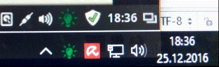

What it is
===

This application is part of light detection project called WC-Bulb. It displays current state as a toolbar icon. 
Works under Windows and Linux. Uses PyQt5.

NodeMCU part is here: [https://github.com/bkosciow/nodemcu_light_detector](https://github.com/bkosciow/nodemcu_light_detector)

See more: [https://koscis.wordpress.com/tag/wc-project/](https://koscis.wordpress.com/tag/wc-project/)

Bulb icons taken from [http://www.iconsdb.com](http://www.iconsdb.com)